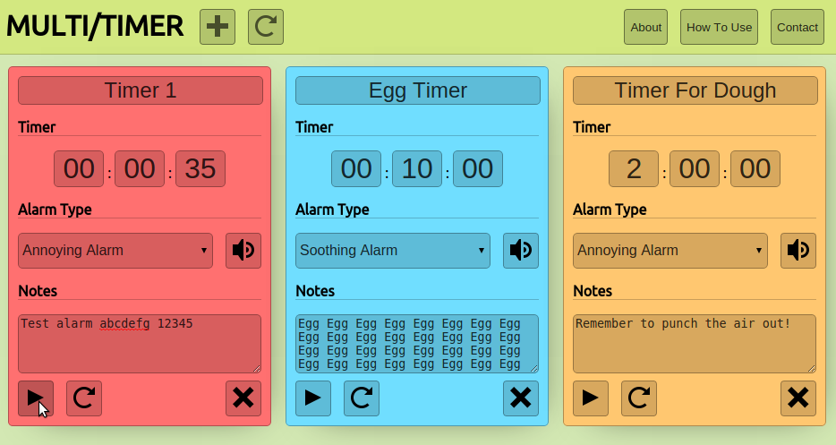

  

This is a small project I made after being frustrated with cooking timer websites. I don't have a mechanical one, and I often have to track the timing of multiple things, which none of these websites do particularly well.

With this tool, you can:
- Quickly create/destroy multiple timers
- Specify identifying details for each timer, such as title and notes, to allow for easier tracking
- Synchronise pausing/playing of alarms

You can find it at [multitimer.io](http://multitimer.io). I also wrote a small thing on the development process of this project [here](http://www.deadcells.org/multitimer/).

## Resources

- The sounds were sourced from [Orange Free Sounds](http://www.orangefreesounds.com/)
- The icons were sourced from [Open Iconic](https://useiconic.com/open/)
